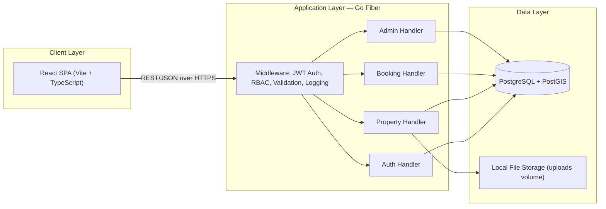
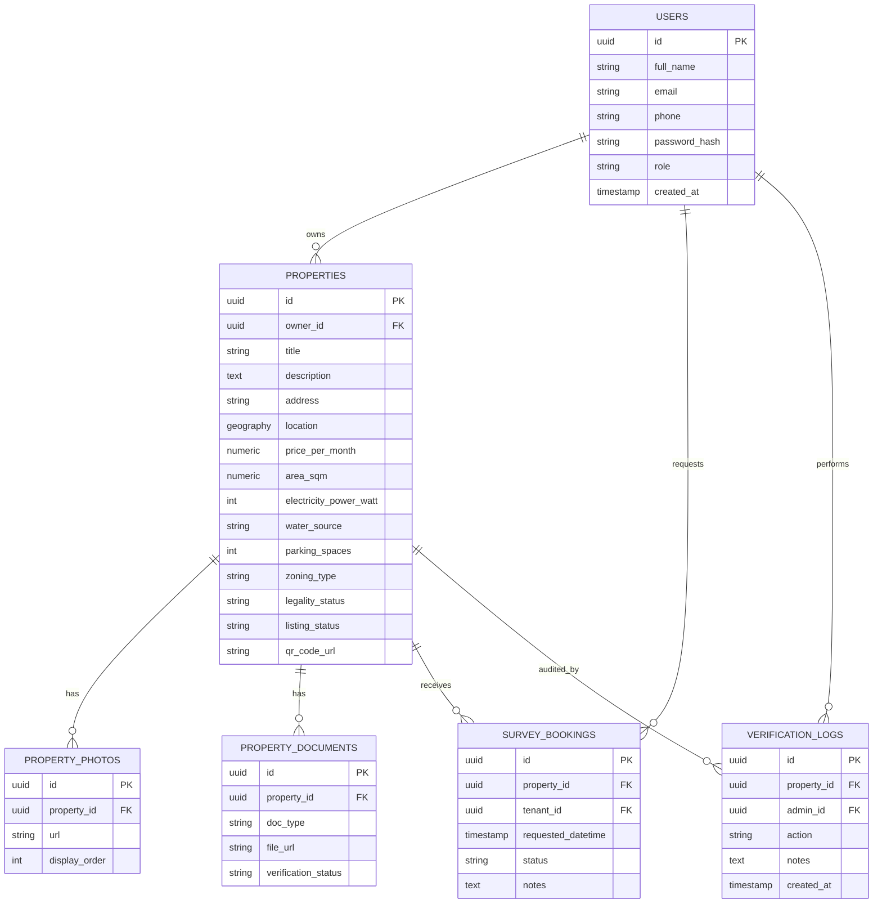

# RukoSpace — Product Requirements Document and One-Day Sprint Plan

**Document status:** Draft v1.0
**Prepared:** 13 July 2026
**Source material:** *Laporan Mini Proyek Literasi Manusia — RukoSpace: Aplikasi Marketplace Penyewaan Ruko* (Universitas Logistik dan Bisnis Internasional, 2026)
**Technology stack mandate:** Backend — Go with the Fiber framework. Frontend — React. All remaining technology choices are selected for optimal fit against the one-day build constraint.

> **Terminology note:** *Ruko* is the Indonesian term for a shophouse — a hybrid commercial-residential building typically used for retail, food and beverage, or office purposes. This document retains the term *ruko* alongside the English equivalent "shophouse property" for precision, since the two are not perfectly synonymous in Indonesian commercial law.

---

## Table of Contents

**Part A — Product Requirements Document**
1. Executive Summary
2. Background and Problem Statement
3. Objectives
4. User Personas and Roles
5. Scope Definition
6. Functional Requirements
7. Non-Functional Requirements
8. Technology Stack and Architecture
9. System Architecture Diagram
10. Data Model
11. API Specification
12. Core User Flows
13. Security and Compliance
14. Success Metrics
15. Risks and Assumptions

**Part B — One-Day Sprint Plan (Four-Person Team)**
1. Team Structure and Role Allocation
2. Pre-Sprint Preparation Checklist
3. Sprint Timeline
4. Detailed Task Breakdown per Person
5. Definition of Done
6. Integration and Testing Strategy
7. Demo Script
8. Risk Mitigation for the Sprint Day
9. Post-Sprint Backlog

---

# Part A — Product Requirements Document

## 1. Executive Summary

RukoSpace connects three user groups within a single platform: prospective tenants searching for commercial shophouse space, owners and agents marketing their properties, and administrators who safeguard data quality and trust. The platform replaces fragmented discovery channels — banners, referrals, social media groups, and unmaintained agent contacts — with a structured marketplace offering location-based search, specification filtering, QR-code-linked property pages, survey scheduling, and administrator-led verification.

This document specifies the full product vision alongside a deliberately constrained **one-day MVP**, buildable by a four-person engineering team using Go Fiber for the backend and React for the frontend. The MVP proves the core discovery-to-survey journey end-to-end. Payment processing, escrow, and digital contract signing are scoped into a post-sprint roadmap, since these features carry regulatory and third-party integration dependencies that a single build day cannot responsibly absorb.

## 2. Background and Problem Statement

Commercial tenants currently gather shophouse information from disconnected sources — physical banners, word of mouth, social media groups, and agents who are frequently unresponsive. Listings omit critical specification data: electricity capacity, water source, parking allocation, business zoning, and legal status (SHM, HGB, PBB). Tenants consequently visit multiple sites in person before determining suitability, at real cost in time, transport, and effort.

Owners and agents face a parallel problem. Marketing reach through physical signage is unmeasured, and repetitive baseline questions from prospective tenants consume disproportionate time. Administrators, meanwhile, hold responsibility for the accuracy of listing data without a system to enforce or audit it.

RukoSpace addresses these three failure points through a single structured platform, built on the human-centred design principle that a system adapts to user needs rather than requiring users to hunt for essential information (ISO 9241-210:2019).

## 3. Objectives

| ID | Objective |
|---|---|
| OBJ-01 | Consolidate shophouse listing data — pricing, specifications, legality, and media — into one searchable platform. |
| OBJ-02 | Reduce tenant pre-survey research time through location-based search and specification filtering. |
| OBJ-03 | Give owners and agents a measurable marketing channel with listing management and enquiry tracking. |
| OBJ-04 | Give administrators the tooling to verify listing data before publication, protecting platform trust. |
| OBJ-05 | Establish a technical foundation that extends cleanly into payment, escrow, and digital contract features in subsequent sprints. |

## 4. User Personas and Roles

| Persona | Primary Goal | Core Pain Point | Key Needs |
|---|---|---|---|
| **Tenant (Calon Penyewa)** | Find and secure a suitable shophouse quickly | Incomplete listings, slow contact response, wasted survey visits | Location search, specification filters, survey scheduling, transparent legality data |
| **Owner / Agent (Pemilik Ruko / Agen)** | Market shophouse inventory efficiently and manage enquiries | Limited promotional reach, repeated baseline questions | Listing dashboard, visit statistics, QR-linked property pages, enquiry management |
| **Administrator** | Maintain data integrity and platform trust | No mechanism to verify listings before publication | Verification queue, document review tooling, reporting and audit trail |

## 5. Scope Definition

### 5.1 In-Scope for the One-Day MVP Build

- Account registration and authentication for tenants, owners/agents, and a seeded administrator account.
- Property listing creation, editing, and photo upload by owners/agents.
- Location-based and specification-based search and filtering for tenants, including a map view.
- Individual property detail pages, each with an auto-generated QR code that deep-links to the page.
- Survey booking requests from tenants, with approval or rejection by owners.
- Administrator verification queue for reviewing and approving or rejecting new listings.
- Role-based dashboards for each of the three personas.

### 5.2 Out-of-Scope for the One-Day MVP Build

The following features remain on the post-sprint roadmap in Part B, Section 9, given their dependency on licensed third-party providers and regulatory compliance work that exceeds a single build day:

- Digital payment processing (virtual account, e-wallet, card).
- Escrow fund holding.
- Digital contract generation and e-signature.
- Automated notification delivery (email, SMS, push).
- Listing-quality analytics and reporting dashboards for owners.

## 6. Functional Requirements

Requirement IDs use the pattern `FR-<role>-<number>`. The **MVP** column marks inclusion in the one-day build.

### 6.1 Authentication and Account Management

| ID | Requirement | MVP |
|---|---|---|
| FR-AUTH-01 | The system allows a new user to register with full name, email, phone number, password, and a role selection of tenant, owner, or agent. | Yes |
| FR-AUTH-02 | The system authenticates users via email and password, issuing a signed JSON Web Token on success. | Yes |
| FR-AUTH-03 | The system enforces role-based access control across every protected endpoint. | Yes |
| FR-AUTH-04 | The system seeds one administrator account during database migration, since public admin self-registration introduces an unnecessary attack surface. | Yes |
| FR-AUTH-05 | The system supports password reset via email token. | No — Sprint 2 |

### 6.2 Tenant Functions

| ID | Requirement | MVP |
|---|---|---|
| FR-T-01 | A tenant searches listings by free-text location, radius, and map bounds. | Yes |
| FR-T-02 | A tenant filters listings by price range, floor area, electricity capacity, parking availability, and zoning type. | Yes |
| FR-T-03 | A tenant views listings as pins on an interactive map alongside a synchronised results list. | Yes |
| FR-T-04 | A tenant opens a property detail page showing photos, specifications, legality status, address, and owner-facing enquiry actions. | Yes |
| FR-T-05 | A tenant requests a survey visit by selecting a preferred date and time slot. | Yes |
| FR-T-06 | A tenant views the status of their submitted survey requests from a personal dashboard. | Yes |
| FR-T-07 | A tenant scans a property's physical QR code to open its detail page directly. | Yes |
| FR-T-08 | A tenant reports a listing suspected of containing false or misleading information. | No — Sprint 2 |
| FR-T-09 | A tenant initiates a digital rental agreement and payment after survey approval. | No — Sprint 3 (payment/escrow/contract roadmap) |

### 6.3 Owner and Agent Functions

| ID | Requirement | MVP |
|---|---|---|
| FR-O-01 | An owner creates a new listing with address, coordinates, price, floor area, electricity capacity, water source, parking count, and zoning type. | Yes |
| FR-O-02 | An owner uploads multiple photographs to a listing. | Yes |
| FR-O-03 | An owner uploads legality documents (SHM, HGB, PBB) as supporting files for administrator review. | Yes |
| FR-O-04 | An owner edits or withdraws an existing listing. | Yes |
| FR-O-05 | An owner views a generated QR code for each active listing, downloadable for physical signage. | Yes |
| FR-O-06 | An owner views and responds to incoming survey requests, setting each to approved, rejected, or completed. | Yes |
| FR-O-07 | An owner views aggregate visit and enquiry statistics per listing. | No — Sprint 2 |

### 6.4 Administrator Functions

| ID | Requirement | MVP |
|---|---|---|
| FR-A-01 | An administrator views a queue of listings pending verification. | Yes |
| FR-A-02 | An administrator reviews uploaded legality documents and photographs against listing claims. | Yes |
| FR-A-03 | An administrator approves a listing, publishing it to public search. | Yes |
| FR-A-04 | An administrator rejects a listing with a mandatory reason, returning it to the owner for correction. | Yes |
| FR-A-05 | An administrator reviews and actions listings flagged by tenant reports. | No — Sprint 2 |

## 7. Non-Functional Requirements

| ID | Category | Requirement |
|---|---|---|
| NFR-01 | Performance | Property search queries return within 300 ms at a catalogue size of up to 10,000 listings, achieved through a spatial index on the location column. |
| NFR-02 | Security | Passwords are hashed with bcrypt at a cost factor of 12 or higher. All protected routes validate a signed JWT via middleware. |
| NFR-03 | Security | File uploads are restricted by MIME type and a 10 MB size ceiling, with filenames sanitised before storage. |
| NFR-04 | Usability | All end-user interface copy is written in Bahasa Indonesia, since the target user base operates in that language; this document itself remains in English per specification. |
| NFR-05 | Scalability | The API server runs statelessly, permitting horizontal scaling behind a load balancer without session-affinity requirements. |
| NFR-06 | Maintainability | Backend code follows a layered structure — handler, service, repository — to isolate business logic from framework and persistence concerns. |
| NFR-07 | Availability | The MVP targets a single-instance deployment for demonstration purposes; production availability targets are defined in the Sprint 2+ roadmap. |
| NFR-08 | Compliance | Personal data handling aligns with the principles of Law No. 27 of 2022 on Personal Data Protection: data minimisation, purpose limitation, and user consent at registration. |
| NFR-09 | Accessibility | Interactive elements meet WCAG 2.1 AA colour-contrast ratios at minimum, given the platform's use by owners across a wide age and technical-literacy range. |

## 8. Technology Stack and Architecture

### 8.1 Backend

| Component | Selection | Rationale |
|---|---|---|
| Language and framework | Go with Fiber | Mandated. Fiber's Express-inspired API accelerates route and middleware authoring within a single-day constraint. |
| ORM / data access | GORM | Reduces boilerplate for CRUD-heavy entities (properties, bookings) against a build-day deadline. sqlc is the recommended alternative for teams prioritising compile-time query safety over development speed. |
| Authentication | golang-jwt/jwt with bcrypt | Standard, dependency-light JWT issuance and password hashing. |
| Validation | go-playground/validator | Struct-tag-based request validation integrates directly with Fiber's binding. |
| API documentation | swaggo/swag | Generates OpenAPI documentation from Go annotations, keeping the frontend team unblocked via a shared contract. |
| QR code generation | skip2/go-qrcode | Generates PNG QR codes server-side at listing-publish time, avoiding a separate microservice. |

### 8.2 Frontend

| Component | Selection | Rationale |
|---|---|---|
| Framework | React 18 with TypeScript | Mandated framework; TypeScript catches contract mismatches against the Go API at compile time, valuable given the compressed build day. |
| Build tool | Vite | Materially faster cold-start and hot-module-reload than Create React App, which shortens iteration cycles during the sprint. |
| Styling | Tailwind CSS | Utility-first styling removes the need for a separate design-token build step within a one-day scope. |
| Data fetching and caching | TanStack Query | Handles loading, error, and cache states for API calls with minimal boilerplate, reducing manually written state logic. |
| Client state | Zustand | Lightweight global state for authentication and UI state, avoiding Redux's setup overhead. |
| Routing | React Router v6 | Standard, well-documented client-side routing. |
| Mapping | Leaflet with OpenStreetMap tiles | Zero licensing cost and no API key provisioning delay, both material constraints on a one-day build. Mapbox GL JS is the recommended alternative once a production budget and richer styling requirements exist. |
| QR display | qrcode.react | Renders the server-generated QR payload client-side where a fresh render is needed without a round trip. |

### 8.3 Data Layer

| Component | Selection | Rationale |
|---|---|---|
| Primary database | PostgreSQL 16 with the PostGIS extension | PostGIS delivers proper geospatial indexing (`GEOGRAPHY` type, GIST index) for radius and bounding-box search, which a plain latitude/longitude column cannot do efficiently at scale. MySQL with its spatial extension is a viable alternative where team familiarity favours MySQL, at the cost of a less mature geospatial function set. |
| Caching | Redis | Reserved for the Sprint 2+ roadmap (session caching, search result caching); omitted from the one-day MVP to limit infrastructure surface area. |
| File storage | Local disk volume, mounted via Docker | Sufficient for a single-instance demo. MinIO (S3-compatible, self-hostable) is the recommended production alternative, requiring only a storage-adapter swap given a properly abstracted upload service. |

### 8.4 Infrastructure and DevOps

| Component | Selection | Rationale |
|---|---|---|
| Local orchestration | Docker Compose | Brings up PostgreSQL, the Fiber API, and the React dev server with one command, eliminating environment-setup friction on the sprint morning. |
| Version control workflow | Trunk-based development with short-lived feature branches | Given a one-day timeline, long-lived branches and formal review cycles introduce unacceptable merge risk; frequent small commits directly against `main`, gated by a pre-commit build check, keep integration continuous. |
| API contract sharing | A committed OpenAPI/Postman collection, agreed before coding begins | Decouples frontend and backend development for the bulk of the sprint. |

### 8.5 Alternative Technology Options

| Decision Point | Chosen Option | Alternative | When to Prefer the Alternative |
|---|---|---|---|
| ORM | GORM | sqlc | When the team prioritises SQL-level control and compile-time query verification over development velocity. |
| Map provider | Leaflet + OpenStreetMap | Mapbox GL JS or Google Maps Platform | When production budget permits API licensing and richer custom map styling is a product requirement. |
| File storage | Local disk | MinIO or AWS S3 | Immediately upon moving past a single-instance demo, to support horizontal scaling and durability. |
| State management | Zustand | Redux Toolkit | When the application's state graph grows complex enough to benefit from Redux DevTools' time-travel debugging. |

## 9. System Architecture Diagram



## 10. Data Model

### 10.1 Entity-Relationship Overview



### 10.2 Schema Definitions (PostgreSQL DDL)

```sql
CREATE EXTENSION IF NOT EXISTS "uuid-ossp";
CREATE EXTENSION IF NOT EXISTS postgis;

CREATE TABLE users (
    id             UUID PRIMARY KEY DEFAULT uuid_generate_v4(),
    full_name      VARCHAR(150) NOT NULL,
    email          VARCHAR(150) UNIQUE NOT NULL,
    phone          VARCHAR(20),
    password_hash  VARCHAR(255) NOT NULL,
    role           VARCHAR(20) NOT NULL CHECK (role IN ('tenant','owner','agent','admin')),
    created_at     TIMESTAMPTZ NOT NULL DEFAULT now(),
    updated_at     TIMESTAMPTZ NOT NULL DEFAULT now()
);

CREATE TABLE properties (
    id                      UUID PRIMARY KEY DEFAULT uuid_generate_v4(),
    owner_id                UUID NOT NULL REFERENCES users(id),
    title                   VARCHAR(200) NOT NULL,
    description             TEXT,
    address                 VARCHAR(255) NOT NULL,
    location                GEOGRAPHY(POINT, 4326) NOT NULL,
    price_per_month         NUMERIC(14,2) NOT NULL,
    area_sqm                NUMERIC(8,2) NOT NULL,
    electricity_power_watt  INTEGER,
    water_source            VARCHAR(50),
    parking_spaces          INTEGER DEFAULT 0,
    zoning_type             VARCHAR(50),
    legality_status         VARCHAR(30) NOT NULL DEFAULT 'unverified',
    listing_status          VARCHAR(30) NOT NULL DEFAULT 'draft',
    qr_code_url             VARCHAR(255),
    created_at              TIMESTAMPTZ NOT NULL DEFAULT now(),
    updated_at              TIMESTAMPTZ NOT NULL DEFAULT now()
);
CREATE INDEX idx_properties_location ON properties USING GIST (location);
CREATE INDEX idx_properties_status ON properties (listing_status);

CREATE TABLE property_photos (
    id             UUID PRIMARY KEY DEFAULT uuid_generate_v4(),
    property_id    UUID NOT NULL REFERENCES properties(id) ON DELETE CASCADE,
    url            VARCHAR(255) NOT NULL,
    display_order  INTEGER DEFAULT 0
);

CREATE TABLE property_documents (
    id                    UUID PRIMARY KEY DEFAULT uuid_generate_v4(),
    property_id           UUID NOT NULL REFERENCES properties(id) ON DELETE CASCADE,
    doc_type              VARCHAR(30) NOT NULL,
    file_url              VARCHAR(255) NOT NULL,
    verification_status   VARCHAR(30) NOT NULL DEFAULT 'pending'
);

CREATE TABLE survey_bookings (
    id                  UUID PRIMARY KEY DEFAULT uuid_generate_v4(),
    property_id         UUID NOT NULL REFERENCES properties(id),
    tenant_id           UUID NOT NULL REFERENCES users(id),
    requested_datetime  TIMESTAMPTZ NOT NULL,
    status              VARCHAR(20) NOT NULL DEFAULT 'pending',
    notes               TEXT,
    created_at          TIMESTAMPTZ NOT NULL DEFAULT now()
);

CREATE TABLE verification_logs (
    id            UUID PRIMARY KEY DEFAULT uuid_generate_v4(),
    property_id   UUID NOT NULL REFERENCES properties(id),
    admin_id      UUID NOT NULL REFERENCES users(id),
    action        VARCHAR(20) NOT NULL,
    notes         TEXT,
    created_at    TIMESTAMPTZ NOT NULL DEFAULT now()
);
```

## 11. API Specification

Base path: `/api/v1`. All protected routes require an `Authorization: Bearer <token>` header. Role restrictions appear in the **Auth** column.

### 11.1 Authentication

| Method | Path | Description | Auth |
|---|---|---|---|
| POST | `/auth/register` | Registers a tenant, owner, or agent account. | Public |
| POST | `/auth/login` | Authenticates and returns a signed JWT. | Public |
| GET | `/auth/me` | Returns the authenticated user's profile. | Any role |

### 11.2 Properties

| Method | Path | Description | Auth |
|---|---|---|---|
| GET | `/properties` | Searches listings with query parameters `lat`, `lng`, `radius_km`, `min_price`, `max_price`, `min_area`, `zoning_type`, `page`, `page_size`. Returns only `listing_status = active` records. | Public |
| GET | `/properties/:id` | Returns full listing detail, including photos and legality summary. | Public |
| POST | `/properties` | Creates a listing in `draft` status. | Owner, Agent |
| PUT | `/properties/:id` | Updates listing fields. | Owner, Agent (own listing) |
| DELETE | `/properties/:id` | Withdraws a listing. | Owner, Agent (own listing) |
| POST | `/properties/:id/photos` | Uploads one or more photographs (multipart form). | Owner, Agent (own listing) |
| POST | `/properties/:id/documents` | Uploads a legality document for verification. | Owner, Agent (own listing) |
| GET | `/properties/:id/qrcode` | Returns the PNG QR code linking to the public detail page. | Public |
| POST | `/properties/:id/submit` | Transitions a listing from `draft` to `pending_verification`. | Owner, Agent (own listing) |

### 11.3 Survey Bookings

| Method | Path | Description | Auth |
|---|---|---|---|
| POST | `/bookings` | Creates a survey request against a property. | Tenant |
| GET | `/bookings/mine` | Returns the authenticated tenant's booking history. | Tenant |
| GET | `/bookings/received` | Returns bookings received against the authenticated owner's listings. | Owner, Agent |
| PATCH | `/bookings/:id/status` | Updates a booking's status to `approved`, `rejected`, or `completed`. | Owner, Agent (own listing) |

### 11.4 Administration

| Method | Path | Description | Auth |
|---|---|---|---|
| GET | `/admin/properties/pending` | Lists all properties in `pending_verification` status. | Admin |
| PATCH | `/admin/properties/:id/approve` | Sets `listing_status` to `active` and `legality_status` to `verified`. | Admin |
| PATCH | `/admin/properties/:id/reject` | Sets `listing_status` to `rejected`, requiring a `reason` field. | Admin |
| GET | `/admin/verification-logs` | Returns the full audit trail of verification actions. | Admin |

## 12. Core User Flows

**Tenant discovery-to-survey flow:** register or log in → search by location and filters → browse map and list view → open property detail → review specifications, photographs, and legality status → submit a survey request with a preferred date and time → track request status on the tenant dashboard.

**Owner listing-creation flow:** register or log in → open the owner dashboard → create a new listing with address, coordinates, and specifications → upload photographs and legality documents → submit for verification → monitor status, correcting and resubmitting on rejection → upon approval, download the generated QR code for physical signage → manage incoming survey requests.

**Administrator verification flow:** log in → open the verification queue → review a pending listing's documents and photographs against its stated claims → approve, publishing the listing to public search, or reject with a documented reason returned to the owner.

## 13. Security and Compliance

- Every password is hashed with bcrypt before storage; plaintext passwords are never logged or persisted.
- JWT tokens carry a short expiry (recommended: 24 hours) with role and user ID claims validated on every protected request.
- File uploads are validated by MIME type and size before acceptance, and are stored outside the web-served static root.
- Personal data collection is limited to fields with a direct product purpose, in line with the data-minimisation principle of Law No. 27 of 2022 on Personal Data Protection.
- A consent checkbox at registration records acknowledgement of data processing for platform functionality.
- Administrator actions on listings are logged immutably in `verification_logs`, providing an audit trail for disputed rejections or approvals.

## 14. Success Metrics

| Metric | Target for the One-Day MVP Demo |
|---|---|
| Functional requirement coverage | 100% of MVP-tagged requirements (Section 6) implemented and demonstrable. |
| Search response time | Under 300 ms for a seeded catalogue of at least 50 listings. |
| End-to-end journey completion | The full tenant discovery-to-survey flow and the full owner listing-to-approval flow both complete without manual database intervention. |
| Critical defects at demo time | Zero defects that block any of the three core user flows in Section 12. |

## 15. Risks and Assumptions

| ID | Type | Description | Mitigation |
|---|---|---|---|
| RA-01 | Assumption | The engineering team has prior working familiarity with Go, Fiber, and React before the sprint day begins. | Pre-sprint preparation checklist (Part B, Section 2) assumes no framework-learning time within the sprint itself. |
| RA-02 | Assumption | A design reference (the RukoSpace Figma file referenced in the source report) is available before the sprint day, removing UI-design time from the schedule. | Confirm design asset availability during pre-sprint preparation. |
| RA-03 | Risk | PostGIS setup complexity could consume disproportionate sprint time. | A fallback bounding-box filter using plain latitude and longitude columns is defined in Part B, Section 8, deployable within minutes if PostGIS setup stalls. |
| RA-04 | Risk | Frontend and backend development could block on each other absent a locked contract. | The API contract (Section 11) is fixed before coding begins, per the pre-sprint checklist. |

---

*End of document.*
